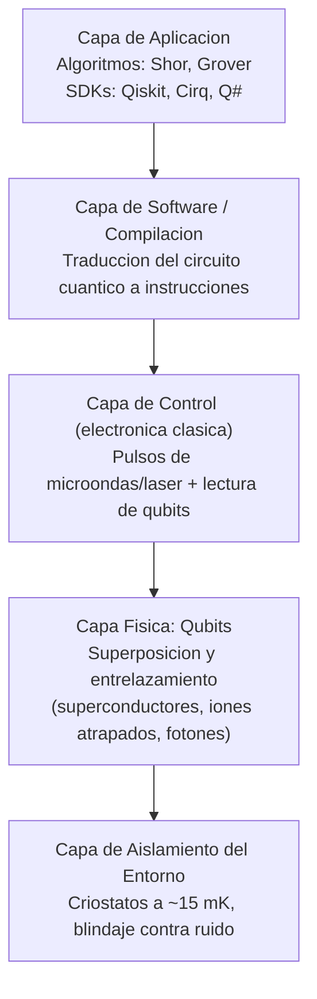
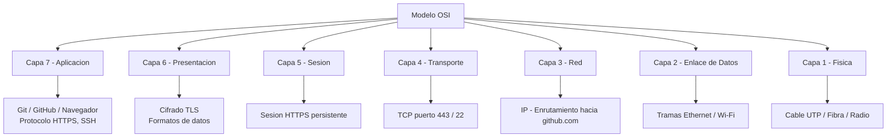
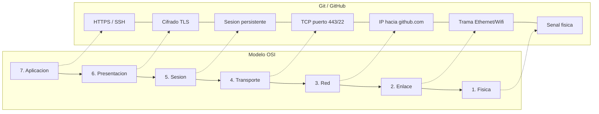

# actividad-8
# Actividad 8 — Nuevas Tecnologías, Criptografía y Modelo OSI

**SENA — Instructor:** Diego Alejandro Barragán Vargas
**Aprendiz:** [Escriba aquí su nombre completo]

Este repositorio contiene el desarrollo completo de la Actividad 8, basada en la
clase de **Criptografía** y en los temas de **Blockchain**, **Computación
Cuántica**, el **Modelo OSI** y el flujo de trabajo de **Git/GitHub**.

## Contenido del repositorio

---

# PUNTO 1 — Nuevas Tecnologías (Blockchain y Criptografía)

## 1.a — Cadena de bloques con mensajería entre dos servidores

El archivo `blockchain_mensajes.py` implementa una blockchain real (no
simulada solo con listas en memoria) donde **dos servidores TCP se
comunican por sockets** sobre `localhost`:

- **Servidor A** (nodo receptor): mantiene la cadena de bloques. Escucha
  conexiones entrantes; cada mensaje que recibe lo convierte en un nuevo
  bloque y lo agrega a su cadena.
- **Servidor B** (nodo emisor): se conecta a Servidor A y le envía varios
  mensajes de ejemplo.

### ¿Cómo se crea un bloque? (paso a paso)

1. Se toma el **hash del último bloque** de la cadena (`previous_hash`).
2. Se arma un nuevo bloque con: índice siguiente, marca de tiempo actual, el
   **mensaje** recibido, el **emisor**, y el hash del bloque anterior.
3. Se calcula el **hash propio** del nuevo bloque aplicando SHA-256 sobre
   todos esos datos juntos (serializados en JSON).
4. El nuevo bloque se agrega al final de la cadena (`chain.append(...)`),
   quedando enlazado de forma verificable al anterior.

Esto significa que si alguien intentara alterar el mensaje de un bloque ya
registrado, su hash cambiaría por completo, y dejaría de coincidir con el
`previous_hash` que guarda el siguiente bloque — delatando la manipulación de
inmediato.

### Funcionalidad de mensajería (resumen del flujo)

## 1.b — ¿Qué tipo de encriptación se maneja en blockchain? ¿Cómo funciona?

Blockchain combina **dos tipos de criptografía**:

| Tipo | Uso dentro de blockchain | Cómo funciona |
|---|---|---|
| **Funciones Hash (SHA-256)** | Enlazar los bloques entre sí y garantizar la integridad | Cada bloque incluye el hash del bloque anterior. Si se altera cualquier dato, su hash cambia por completo (efecto avalancha) |
| **Criptografía asimétrica (ECDSA)** | Firmar transacciones y verificar identidad | La clave privada firma la transacción; la clave pública permite verificar esa firma sin conocer la clave privada |

El **hash** asegura que nadie pueda modificar el historial sin que se note, y
la **firma digital** asegura que nadie registre algo en nombre de otro
usuario sin su clave privada.

## 1.c — Funcionamiento de una cadena de bloques en una transacción bancaria

1. Un cliente inicia una transferencia (Cuenta A → Cuenta B).
2. La transacción se firma con la **clave privada** del cliente.
3. Se transmite a la red de nodos, que la agrupan en un **bloque candidato**.
4. Los nodos validan: firma, saldo suficiente, y que no sea doble gasto.
5. Mediante un **mecanismo de consenso** (ej. Proof of Stake en redes
   bancarias permisionadas como Hyperledger o R3 Corda), se acepta el bloque.
6. El bloque se añade enlazado por hash, quedando **inmutable y trazable**.
7. Los saldos se actualizan en el nuevo estado de la cadena.

La ventaja frente a un sistema centralizado es la **trazabilidad compartida**
entre varias entidades, sin depender de un único libro contable central.

## 1.d — ¿Cómo se comporta blockchain ante la computación cuántica?

Blockchain es **vulnerable a futuro**:

- Las **firmas digitales** (ECDSA) podrían romperse con el **algoritmo de
  Shor** en una computadora cuántica suficientemente grande, permitiendo
  falsificar firmas.
- Las **funciones hash** (SHA-256) son más resistentes: el algoritmo de
  Grover solo da una aceleración cuadrática (no exponencial), así que
  duplicar el tamaño del hash bastaría para compensarlo.

Por esto se estudia migrar hacia **firmas digitales post-cuánticas**
(basadas en retículos, hash o códigos correctores).

## 1.e — Computación cuántica: definición y tipos de seguridad

**¿Qué es la computación cuántica?**
Un paradigma que usa **qubits** (que pueden representar 0 y 1 a la vez,
gracias a la superposición) en lugar de bits clásicos, permitiendo resolver
ciertos problemas (factorización, búsqueda, simulación molecular) de forma
exponencialmente más eficiente.

**Tabla de tipos de seguridad:**

| Tipo de seguridad | Base de la seguridad | Resistencia cuántica | Ejemplo de uso |
|---|---|---|---|
| Criptografía clásica (RSA, ECC) | Complejidad matemática | Vulnerable (algoritmo de Shor) | HTTPS/TLS actual |
| Criptografía post-cuántica (PQC) | Problemas difíciles incluso para cuánticas (retículos, hash) | Diseñada para resistir | Estándares NIST (Kyber, Dilithium) |
| Distribución cuántica de claves (QKD) | Leyes de la física cuántica | Muy alta; detecta espionaje | Comunicaciones gubernamentales/financieras |

**Arquitectura de la Computación Cuántica (capas):**

**Conceptos clave:** Superposición (0 y 1 a la vez), Entrelazamiento (estados
ligados entre qubits), Decoherencia (pérdida del estado cuántico por el
entorno — el mayor reto técnico), Corrección de errores (varios qubits
físicos forman un qubit lógico estable), Algoritmo de Shor (amenaza futura
para RSA/ECC).

---

# PUNTO 2 — Pregunta Integradora: El viaje de Commit a GitHub

## 2.a — Modelo OSI: explicación de cada capa

| # | Capa | Función principal | Ejemplo |
|---|---|---|---|
| 7 | Aplicación | Interfaz con los programas del usuario | Navegador, Git/GitHub |
| 6 | Presentación | Traduce, cifra/descifra y comprime datos | TLS/SSL, JPEG, ZIP |
| 5 | Sesión | Establece y mantiene la conversación entre equipos | Sesión HTTPS persistente |
| 4 | Transporte | Entrega confiable, ordenada y sin errores | TCP, UDP |
| 3 | Red | Enrutamiento entre redes mediante direccionamiento lógico | IP, routers |
| 2 | Enlace de Datos | Empaqueta bits en tramas, acceso al medio local | Ethernet, Wi-Fi, MAC |
| 1 | Física | Transmite bits como señales | Cables UTP, fibra, Wi-Fi |

### Mapa conceptual

## 2.b — ¿En qué parte del modelo OSI estarían Git y GitHub?

**Git** y **GitHub** operan principalmente en la **Capa 7 (Aplicación)**,
apoyándose en las capas inferiores para transmitirse por la red:

## 2.c — El modelo OSI y la ciberseguridad en tu colegio

*(Pregunta de reflexión personal — adapta esto con la realidad de tu
institución):*

- **Elementos de tu entorno:** tipo de red (cableada/Wi-Fi), si hay firewall
  o proxy institucional, antivirus centralizado, portal cautivo, servicios en
  la nube usados (Google Workspace, plataforma SENA, etc.).
- **Capas OSI visibles:** Capa 1-2 en el cableado y puntos de acceso Wi-Fi;
  Capa 3 en el direccionamiento IP interno; Capa 7 en las plataformas
  educativas (HTTPS).
- **Criptografía:** HTTPS en el acceso a plataformas (candado del navegador),
  autenticación usuario/contraseña, y en algunos casos MFA para el correo.

## Escenario: verificación antes del `git push`

### Paso 1 — Conectividad básica y resolución de nombres

- **Comando:** `ping github.com` → Capa 3 (Red), protocolo **ICMP**.
- **Resolución de IP:** mediante **DNS** (Capa 7, sobre UDP/TCP puerto 53).
  Si falla: `nslookup github.com` o `dig github.com`.
- **Latencia alta y variable:** afecta la métrica de **latencia** y su
  variación (**jitter**); puede hacer que el `git push` tarde más o que la
  conexión TCP se corte por timeout.
- **Elemento criptográfico entre Git y GitHub:** sí, **TLS** si se usa HTTPS
  (cifra datos y credenciales), o **criptografía asimétrica SSH** (par de
  claves pública/privada) si se usa `git@github.com:...`.

### Paso 2 — Establecimiento de la conexión para el push

- **Protocolo:** TCP. **Three-way handshake:** 1) cliente envía **SYN**,
  2) servidor responde **SYN-ACK**, 3) cliente responde **ACK** — conexión
  establecida.
- **Herramienta para ver segmentos TCP:** Wireshark, filtro:
  `ip.addr == <IP_de_github.com> && tcp.port == 443`
- **Puertos:** origen dinámico (alto), destino **443** (HTTPS) o **22**
  (SSH) — gestionados en la **Capa 4 (Transporte)**.

### Paso 3 — Encapsulamiento y enrutamiento

| Capa | Nombre de la PDU |
|---|---|
| Aplicación | Datos |
| Transporte | Segmento |
| Red | Paquete |
| Enlace de Datos | Trama |
| Física | Bits |

- **Router congestionado:** provoca **retransmisiones** y lentitud; se
  activa el **control de congestión de TCP**. Para diagnosticar el salto
  exacto: `tracert github.com` (Windows) / `traceroute github.com` (Linux).
- **Campo que evita bucles infinitos:** **TTL (Time To Live)** — se reduce
  en 1 en cada salto; al llegar a 0, el router descarta el paquete.

### Paso 4 — Confirmación y fin de la comunicación

- **Confirmación de recepción:** mensajes **ACK**, relacionados con la
  **fiabilidad** de TCP (si no llega ACK, se retransmite el segmento).
- **Cierre ordenado:** intercambio de banderas **FIN/ACK** en ambos sentidos.
- **Monitoreo SNMP:** bytes tx/rx (`ifInOctets`/`ifOutOctets`), paquetes
  descartados (`ifOutDiscards`), errores de interfaz. Para consultas
  cifradas y autenticadas: usar **SNMPv3** (v1 y v2c van en texto plano).

## Conceptos de teletráfico

- **Latencia:** tiempo de viaje de un paquete origen→destino.
- **Jitter:** variación de la latencia entre paquetes.
- **Pérdida de paquetes:** % de paquetes que no llegan.
- **Throughput:** datos realmente transferidos por unidad de tiempo.

